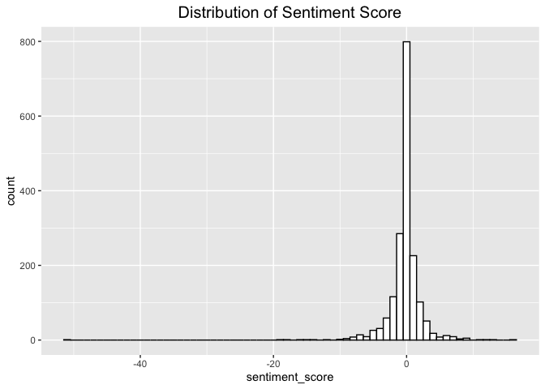
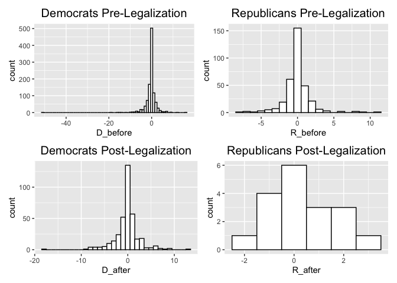
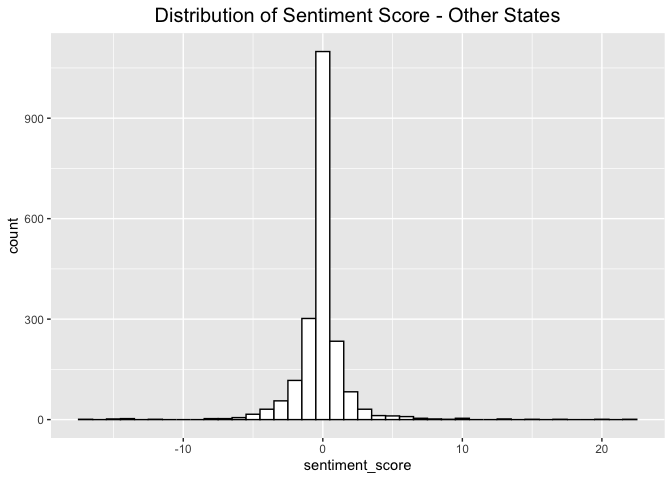
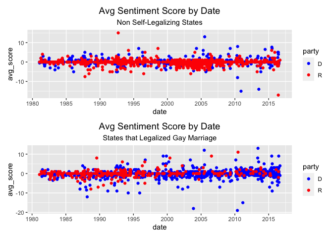

# Sentiment Analysis of LGBTQ Issues in US Congressional Speeches

This project was originally completed for a Text as Data course. The goal of this project is to evaluate the sentiment of US Congressional speeches discussing LGBTQ issues, and investigate whether there is a relationship between speech sentiment and the passing of LGBTQ legislation, specifically the legalization of same-sex marriage at the state level. It also explores the effect of speakers’ state and political party on the sentiment of LGBTQ related speeches.

## Data
### hein-daily
* Dataset of textual data from the “Congress Record for the 43rd-114th Congresses: Parsed Speeches and Phrase Counts”
* Distributed by the [Stanford Libraries Social Science Data Collection](https://data.stanford.edu/)
* Contains all text spoken on the floor of both the US House of Representatives and the US Senate, from the 97th to 114th Congresses (1873 to 2017), as well as metadata about each speech and speaker.

### negative-words
Data dictionary of negative words from [Hu and Liu (2004)](https://www.cs.uic.edu/~liub/publications/kdd04-revSummary.pdf)

### positive-words
Data dictionary of positive words from [Hu and Liu (2004)](https://www.cs.uic.edu/~liub/publications/kdd04-revSummary.pdf)

### marriage_law_dates
Same-sex marriage legalization dates returned from Google, for states who legalized prior to the 2015 Supreme Court ruling in *Obergefell v. Hodges*.

### Data Processing
[code](https://github.com/CarolynKolaczyk/Congress-LGBTQ-Sentiment-Analysis/blob/main/data_processing.ipynb)

Each session has a 3-digit code eg. the 97th Congress has code 097. For each session, we merge data from 3 files: descr_###.txt, speeches_###.txt, and ###_SpeakerMap.txt. We perform an inner join on these 3 files on variable 'speech_id', then select the following variables to use in our analysis:
* 'speakerid': unique identifier for speaker
* 'speech_id': unique identifier for speech
* 'state': speaker state
* 'party': speaker political party
* 'date': date of speech
* 'speech': text of speech-data

We repeat this for all sessions.

## Sentiment Analysis
[code](https://github.com/CarolynKolaczyk/Congress-LGBTQ-Sentiment-Analysis/blob/main/sentiment_analysis.md)

Since our data is unlabeled, we must use an unsupervised method to perform sentiment analysis. We choose to use the data dictionaries of positive and negative words from [Hu and Liu (2004)](https://www.cs.uic.edu/~liub/publications/kdd04-revSummary.pdf).To create a sentiment score, we count the number of positive words and negative words in each document, and calculate sentiment score as the number of positive words minus the number of negative words. Thus, a positive score signifies a positive sentiment, a negative score signifies a negative sentiment, and a score close to zero suggests a neutral sentiment.

To evaluate the relationship between sentiment and same-sex marriage legalization date, we compare the distribution of sentiment score for documents before and after legalization, as well as at the party level (Democrat vs. Republican). For comparison purposes, we also evaluate the sentiment scores for LGBTQ speech-text data by representatives from all other states, but we do not split this data into groups by date. We only evaluate overall and by party.

## Results
For states who legalized same-sex marriage prior to federal legalization, we find that the overall distribution of sentiment scores appears to be centered at zero, indicating a neutral sentiment. 

We also examine the distribution of sentiment scores by party and by date classification (before or after legalization). All four distributions appear to be approximately centered at zero.

For comparison purposes, we next examine the sentiment scores of speech-text data by represen- tatives from states where same-sex marriage was not legal until the Obergefell v. Hodges decision. Similar to the distribution for states that legalized same-sex marriage, this distribution is centered at zero, although it does not appear to be skewed).

Finally, we plot the sentiment scores of each generated document by date, for both categories of states and distinguishing by party.

Unsurprisingly, all sentiment scores appear to be centered around zero regardless of date. However, we see that for states that legalized same-sex marriage before the Supreme Court decision, there is a larger variation in sentiment scores in the years after 2000. For states that legalized same-sex marriage, we also see that after the year 2000 there are many more Democratic data points than Republican. This is most likely due to the fact that these are liberal leaning states, and therefore are more likely to have Democratic representatives than Republican ones. Another interesting observation is that between approximately 1987 and 1997, for states that legalized same-sex marriage, there appears to be a greater number of larger magnitude negative sentiment scores than any other time period. This could perhaps correspond to the peak of the AIDs epidemic in the US.

## Extreme Examples
