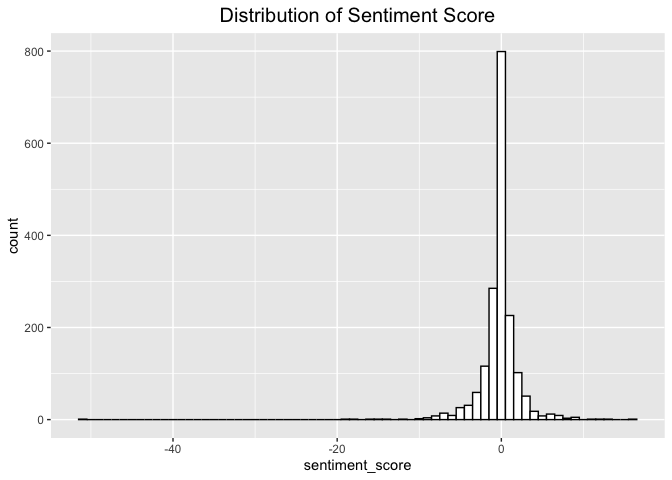
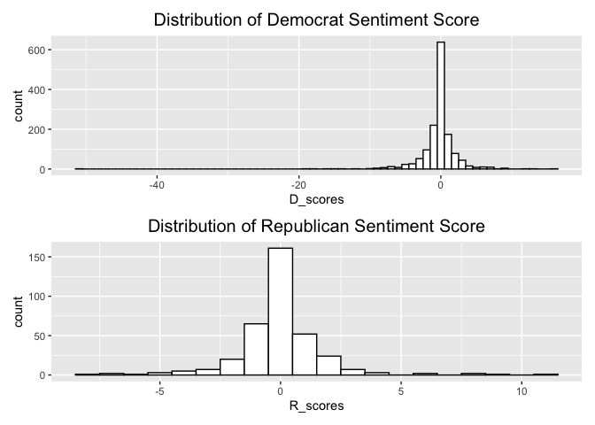
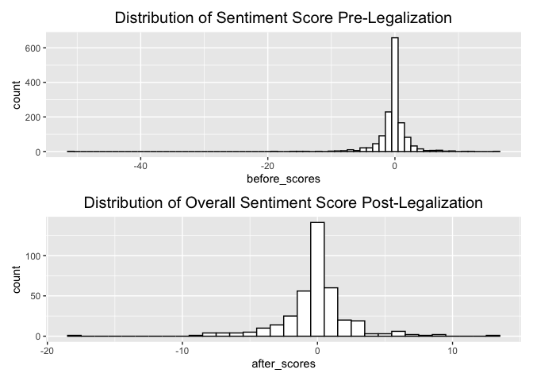
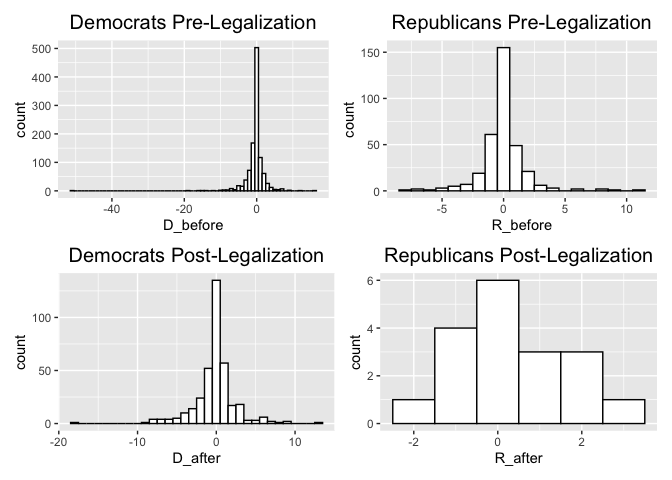
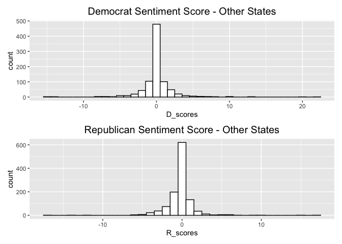
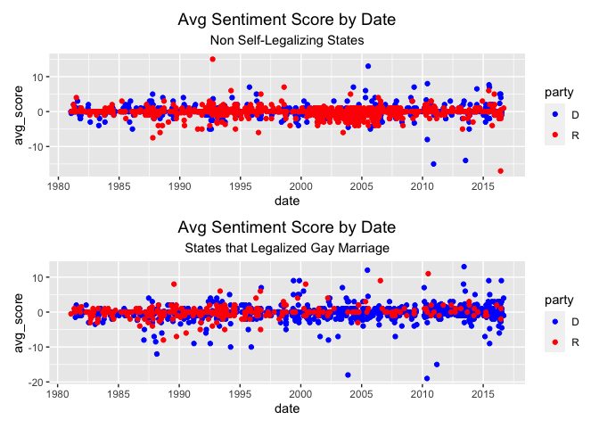

Sentiment Analysis
================
Carolyn Kolaczyk
2023-06-08

``` r
pacman::p_load(dplyr,
               quanteda,
               ggplot2, 
               stringi,
               patchwork) 
```

## State-Level Gay Marriage Legalization

We start by focusing on states that legalized same-sex marriage prior to
the Obergefell v. Hodges decision in 2015, which legalized same-sex
marriage at the federal level in the United States.

``` r
# create function to use with lapply
get_lgbt_data <- function(speech){
  speech = tolower(speech)
  search = "lgbt|trans$|gay|transgender|bisexual|lesbian|queer|asexual|intersex|nonbinary"
  # split into sentences
  sentences<- unlist(stri_split(str = speech, regex = "(?<=[?!.])\\s"))
  # search for lgbt query
  query <- stri_detect_regex(str = sentences, pattern = search) 
  # get lgbt sentences only, combine into 1 document each
  lgbt <- paste(sentences[query], collapse=" ")
  return(lgbt)
}

# read in gay marriage legalization dates
df_marriage <- read.csv('./data/marriage_law_dates.csv')
# convert date from string to date
df_marriage$Date <- as.Date(df_marriage$Date,format='%Y-%m-%d')

# Congressional Record session ids
ids = c('097', '098', '099', '100', '101', '102', '103', '104', '105', 
       '106', '107', '108', '109', '110', '111', '112', '113', '114')

# create new function for splitting data
get_split_data<- function(state_id){
  df_full_made = FALSE # boolean to know when to initialize df_full
  legislation_date = df_marriage[df_marriage$State == state_id,]$Date
  for (session_id in ids){
    #print(paste('Processing session', session_id))
    # read in session data
    file_name = paste('data/processed_data_', session_id,'.csv', sep='')
    data = read.csv(file_name)
    data <- data[,-1]
    # convert date to date type
    data$date <- as.Date(data$date,format='%Y-%m-%d')
    # filter by this state
    state_data <- data[data$state == state_id,]
    # filter so party is only D or R
    state_data <- state_data[state_data['party'] == 'R' | state_data['party'] == 'D',]
    # get only speech, state, party, date
    state_data <- state_data[,c('party', 'state', 'speech', 'date')]
    
    # group by date and party, paste speeches together
    state_data <- state_data %>% 
      group_by(date, party, state) %>% 
      summarise(text = paste(speech, collapse = " "))

    # apply lgbt function to columns
    state_data$text <- unlist(lapply(state_data$text, get_lgbt_data))
    # drop blank columns
    state_data <- state_data[state_data$text != "",]
    # add column with before_after flag
    state_data$before_after <- ifelse(state_data$date <legislation_date, 'before', 'after')
    
    # append dataframes as necessary
    if(dim(state_data)[1] == 0){
      next
    }
    
    if (df_full_made == FALSE){
      df_full = state_data
      df_full_made = TRUE
    }
    else{
      df_full = rbind(df_full, state_data)
    }
  }
  return(df_full)
} 
```

Now we run the above function on all states who legalized gay marriage
before the supreme court decision

``` r
states = df_marriage$State

# iterate over all states
for (state_id in states){
  print(paste('State:', state_id))
  df <- get_split_data(state_id)
  if (state_id == 'CT'){
    df_all_states = df
  }
  else{
    df_all_states = rbind(df_all_states, df)
  }
}
```

    ## [1] "State: CT"
    ## [1] "State: DE"
    ## [1] "State: HI"
    ## [1] "State: IL"
    ## [1] "State: IA"
    ## [1] "State: ME"
    ## [1] "State: MD"
    ## [1] "State: MA"
    ## [1] "State: MN"
    ## [1] "State: NV"
    ## [1] "State: NH"
    ## [1] "State: NJ"
    ## [1] "State: NM"
    ## [1] "State: NY"
    ## [1] "State: RI"
    ## [1] "State: VT"
    ## [1] "State: VA"
    ## [1] "State: WA"
    ## [1] "State: CA"

``` r
# save to csv
file_name = 'data/state_legalized_marriage_equality_lgbt_data.csv'
write.csv(df_all_states, file_name)
```

### Sentiment Analysis

``` r
# read in data
file_name = 'data/state_legalized_marriage_equality_lgbt_data.csv'
lgbt_data <- read.csv(file_name)
lgbt_data <- lgbt_data[,-1]
dim(lgbt_data)
```

    ## [1] 1798    5

``` r
head(lgbt_data)
```

    ##         date party state
    ## 1 1981-02-06     R    CT
    ## 2 1982-09-16     R    CT
    ## 3 1982-09-21     R    CT
    ## 4 1983-07-20     D    CT
    ## 5 1984-02-29     R    CT
    ## 6 1984-06-20     D    CT
    ##                                                                                                                                                                                                                                                                                                                                                                         text
    ## 1                                                                                                                                                                                                                                                                                                                                                  i rise in tribute to gay.
    ## 2                                                                                                                                                                                                                                                                                                                                              of feeling queer or whatever?
    ## 3                                                                                                                                                                                                                                                                                           in the eyes of their schoolmates they will be queer or different or irreligious.
    ## 4 noel gayler. admiral gayler said: the mx works against all of the arms cont rol objectives endorsed by the scowcroft commission. let me quote admiral gayler nigain talking about mx as a path to the midgetman missile. admiiral gayler. admiral gayler. admiral gayler says: i think we cant build a oational consenisus on an idea so faulty as the mx. admiral gayler.
    ## 5                                                                                                                                                                                            set out in 1978 to learn more about great grandfather gay and his involvement in the civil war. gay of union. ida gay santos. jonah gay. alphonso gay. rosa king gay. rosa gay.
    ## 6                                                                                                                                             noel gayler. admiral gayler predicted to the foreign relations committee: when an mx program. admiral gaylcrs fear is not based on fantasy. this is exactly the fear that admiral gayler expressed in the mxmidgetman context.
    ##   before_after
    ## 1       before
    ## 2       before
    ## 3       before
    ## 4       before
    ## 5       before
    ## 6       before

We use a dictionary approach for determining sentiment.

``` r
# remove apostrophes
lgbt_data$text <- gsub(pattern = "'", "", lgbt_data$text) 
# create corpus
corp <- corpus(lgbt_data, text_field = 'text')

# create dfm, removing punctuation and setting to lower
dfm <- tokens(corp, remove_punct = TRUE) %>% 
  dfm(tolower=TRUE)

# read in positive and negative words (Hu & Liu (2004))
positive_words <- read.csv('data/positive-words.txt', sep='\n', header=FALSE)
negative_words <- read.csv('data/negative-words.txt', sep='\n', header=FALSE)
names(negative_words) <- "word"
names(positive_words) <- "word"
# create lists 
negative_words <- negative_words$word
positive_words <- positive_words$word

# generate sentiment score
# get dfm of only positive words
dfm_positive_words <- dfm %>% dfm_select(positive_words)
# get dfm of only negative words
dfm_negative_words <- dfm %>% dfm_select(negative_words)

# get counts of words (tokens) per document
count_neg_words <- ntoken(dfm_negative_words)
count_pos_words <- ntoken(dfm_positive_words)

# get difference in these counts (# pos - # neg)
sentiment_score <- count_pos_words - count_neg_words

# add this into docvars for dfm_reviews
docvars(dfm, "sentiment_score" ) <- sentiment_score

# create histogram to visualize distribution of sentiment score over all docs
p <- ggplot() + aes(sentiment_score) + 
  geom_histogram(binwidth=1, colour="black", fill="white") +
  ggtitle("Distribution of Sentiment Score") +
  theme(plot.title = element_text(size=15, hjust=0.5))
p
```

<!-- -->

Now we compare the distribution of sentiment score across parties, and
before and after the legalization of same-sex marriage at the state
level.

``` r
# D vs R overall
D_scores <- dfm_subset(dfm, party == 'D')$sentiment_score
R_scores <- dfm_subset(dfm, party == 'R')$sentiment_score

p_D <- ggplot() + aes(D_scores) + 
  geom_histogram(binwidth=1, colour="black", fill="white") +
  ggtitle("Distribution of Democrat Sentiment Score") +
  theme(plot.title = element_text(size=15, hjust=0.5))
p_R <- ggplot() + aes(R_scores) + 
  geom_histogram(binwidth=1, colour="black", fill="white") +
  ggtitle("Distribution of Republican Sentiment Score") +
  theme(plot.title = element_text(size=15, hjust=0.5))

p_D / p_R 
```

<!-- -->

``` r
# before vs after overall
before_scores <- dfm_subset(dfm, before_after == 'before')$sentiment_score
after_scores <- dfm_subset(dfm, before_after == 'after')$sentiment_score
# plot
p_before <- ggplot() + aes(before_scores) + 
  geom_histogram(binwidth=1, colour="black", fill="white") +
  ggtitle("Distribution of Sentiment Score Pre-Legalization") +
  theme(plot.title = element_text(size=15, hjust=0.5))
p_after <- ggplot() + aes(after_scores) + 
  geom_histogram(binwidth=1, colour="black", fill="white") +
  ggtitle("Distribution of Overall Sentiment Score Post-Legalization") +
  theme(plot.title = element_text(size=15, hjust=0.5))
p_before / p_after
```

<!-- -->

``` r
# D vs R vs before vs after (4 plots)
D_before <- dfm_subset(dfm, party == 'D' & before_after=='before')$sentiment_score
D_after <- dfm_subset(dfm, party == 'D' & before_after=='after')$sentiment_score
R_before <- dfm_subset(dfm, party == 'R' & before_after=='before')$sentiment_score
R_after <- dfm_subset(dfm, party == 'R' & before_after=='after')$sentiment_score
# plot
p_D_before <- ggplot() + aes(D_before) + 
  geom_histogram(binwidth=1, colour="black", fill="white") +
  ggtitle("Democrats Pre-Legalization") +
  theme(plot.title = element_text(size=15, hjust=0.5))
p_D_after <- ggplot() + aes(D_after) + 
  geom_histogram(binwidth=1, colour="black", fill="white") +
  ggtitle("Democrats Post-Legalization") +
  theme(plot.title = element_text(size=15, hjust=0.5))
p_R_before <- ggplot() + aes(R_before) + 
  geom_histogram(binwidth=1, colour="black", fill="white") +
  ggtitle("Republicans Pre-Legalization") +
  theme(plot.title = element_text(size=15, hjust=0.5))
p_R_after <- ggplot() + aes(R_after) + 
  geom_histogram(binwidth=1, colour="black", fill="white") +
  ggtitle("Republicans Post-Legalization") +
  theme(plot.title = element_text(size=15, hjust=0.5))

(p_D_before +p_R_before) / (p_D_after+p_R_after)
```

<!-- -->
\#### Democrats vs Republicans: We can see that both distributions seem
to be centered around zero, but the Democrats distribution seems to be
ever so slightly left skewed.

#### Before vs After Legalization:

Both seem to be centered around zero

#### By Party and Date:

We can see that there are much less data points for after legalization.
This makes it difficult to do comparison, especially for Republicans.
This can also be informative, as it tells us Republicans are discussing
lgbtq subjects much less than Democrats.

Now we compare average sentiment scores.

``` r
# average sentiment score for each party
print(paste('Avg Sentiment Score for Democrats', mean(D_scores)))
```

    ## [1] "Avg Sentiment Score for Democrats -0.28174878556558"

``` r
print(paste('Avg Sentiment Score for Republicans', mean(R_scores)))
```

    ## [1] "Avg Sentiment Score for Republicans -0.0224089635854342"

Both scores are negative but the scores for Democrats is more negative.

``` r
# By party and date
print(paste('Avg Sentiment Score for Democrats Before', mean(D_before)))
```

    ## [1] "Avg Sentiment Score for Democrats Before -0.324048282265552"

``` r
print(paste('Avg Sentiment Score for Democrats After', mean(D_after)))
```

    ## [1] "Avg Sentiment Score for Democrats After -0.156593406593407"

``` r
print(paste('Avg Sentiment Score for Republicans Before', mean(R_before)))
```

    ## [1] "Avg Sentiment Score for Republicans Before -0.0412979351032448"

``` r
print(paste('Avg Sentiment Score for Republicans After', mean(R_after)))
```

    ## [1] "Avg Sentiment Score for Republicans After 0.333333333333333"

We can see that in both cases, the average sentiment scores increases
after gay marriage is legalized. It increases by 0.1675 for the
Democrats, and 0.3746 for the Republicans. It seems that Republicans
sentiment about lgbtq issues increases more after legalization than
Democrats. This could make sense if we think about how many/most
Democrats already support gay marriage, so it makes sense that their
stance wouldn’t be as affected by legalization.

### Extreme Examples

We now look at documents with the highest and lowest sentiment scores,
to evaluate the accuracy of our metric.

``` r
# add sentiment score to corp
docvars(corp) <- docvars(dfm)
# get sentiment scores
scores <- docvars(corp, 'sentiment_score')
scores <- sort(scores)
# get top 5 and bottom 5 values
top_5 <- head(scores)
bottom_5 <- tail(scores)
top_5
```

    ## [1] -51 -19 -18 -16 -15 -14

``` r
bottom_5
```

    ## [1]  9  9 11 12 13 16

``` r
# get most negative docs
print(as.character(corpus_subset(corp, sentiment_score==-51)))
```

    ##                                                                                                                                                                                                                                                                                                                                                                                                                                                                                                                                                                                                                                                                                                                                                                                                                                                                                                                                                                                                                                                                                                                                                                                                                                                                                                                                                                                                                                                                                                                                                                                                                                                                                                                                                                                                                                                                                                                                                                                                                                                                                                                                                                                                                                                                                                                                                                                                                                                                                                                                                                                                                                                                                                                                                                                                                                                                                                                                                                                                                                                                                                                                                                                                                                                                                                                                                                                                                                                                                                                                                                                                                                                                                                                                                                                                                                            text594 
    ## "there is compelling evidence that antigay harassment was pervasive at fort campbell during this period. the inspector general reported multiple examples of antigay graffiti. \"could be viewed as harassment.\" outside groups have documented many instances of antigay harassment in the months leading up to the murder. but that he was nevertheless not aware of even a single instance of antigay harassment before the murder. after enduring antigay harassment for many months. it seems clear that if general clark had exercised his responsibility to deal with the serious antigay harassment that was prevalent at fort campbell during his 17 months of command leading up to the murder of private winchell. the potential for such a crime was magnified in this case because of the existing climate of antigay harassment at fort campbell. general clark states that he was not aware of any instance of antigay harassment on the base before the murder. the murder should have made painfully clear that antigay bias and antigay harassment were real and pressing problems at fort campbell. that there was \"no evidence\" that private winchell was killed because he was gay. antigay harassment continued in the months following the murder. the continuing antigay harassment at fort campbell was also accompanied by a sudden exodus of soldiers discharged for violations of the homosexual conduct policy. instead of dealing directly with the problem of antigay harassment. he refused to meet with groups concerned about the welfare of gay soldiers. including a local gay community group. he did not even once speak out against the specific problems of antigay harassment and antigay violence. but hardly sufficient to address the specific problem of antigay harassment. private winchells murder was an antigay hate crime. general clark has been asked repeatedly for instances in which he spoke publicly about antigay harassment. but none of these examples dealt with the specific problem of antigay harassment. and outlines the initiatives we had undertaken to eliminate antigay harassment. in fact the article itself contains no information regarding efforts to address antigay harassmentnot even a statement that such harassment is wrong. there is nothing in the article about antigay harassment. at a rotary club meeting in march 2000--another event listed by general clark as an example of his efforts to address antigay harassmentpress reports. newspaper reports of general clarks rotary club speech contained no mention of any statement condemning antigay harassment. to find out whether in fact general clark made any statements specifically addressing antigay harassment and antigay violence following the winchell murder. major general clark was personally involved in talking to commanders at all levels about the antigay harassment. discrimination against gays is codified in the ban on their service in military. in reporting antigay discrimination. which makes it even more essential for leaders to act quickly and effectively in response to attacks on soldiers perceived to be gay. general clark did not take responsibility for addressing the problem of antigay harassment at fort campbell after the murder. general clark declined to meet with the gay groups. and declined to meet with gay veterans organizations. did not make any public statements or issue any written directives and never publicly communicated an appreciation of the harm caused by the antigay murder. two fort campbell soldiers murdered barry winchell because they believed him to be gay. this murder and additional problems with antigay harassment occurred during the tenure of commander clark and there has been no response."

``` r
print(as.character(corpus_subset(corp, sentiment_score==-19)))
```

    ##                                                                                                                                                                                                                                                                                                                                                                                                                                                                                                                                                                                                                                                                                                                                                                                                                                                                                                                                                                                                                                                                                                                                                                                                                                                                                                                                      text718 
    ## "gay americans continue to be treated as secondclass citizens in our society and under our laws. nowhere is the unequal treatment of gay americans more destructive than in our nations public schools. federal law provides no explicit protection to gay students against discrimination and harassment. let me tell you a sad factnearly nine out of ten lgbt students are harassed in school. a gay high school student from california who was harassed in school. it is no wonder that gay students who are harassed in school are more likely to skip school. the harassment of lgbt students can lead to lifethreatening violence and suicide. carl was taunted by his classmates on a daily basis for allegedly being gay despite his mothers weekly pleas to his school to address the problem. was shot and killed by a classmate for allegedly being gay. it is not simply students who are to blame for the harassment of their gay classmates. students who harass their gay peers have often internalized the antigay bias of the adults around them. whose teachers mocked him in front of his classmates for allegedly being gay. and adopted new rules to prevent the harassment of lgbt students. no student should be subjected to the ridicule and physical violence that lgbt students so often experience in school."

``` r
print(as.character(corpus_subset(corp, sentiment_score==16)))
```

    ##                                                                                                                                                                                                                                                                                                                                                                                                                                                                                                                                                                                                                                                                                                                                                                                                                                                                                                                                                                                                                                                                                                                                                                                                                                                                                                                                                                                                                                                                                                                                                                                                                                                                                                                                                                                                                                                                                                                                                                                                                                                                                                                                                                                                                                                                                                                                                                                                                                                                                                                                                                                                                                                                                                                                                                                                                                                                                                                                                                                            text1712 
    ## "he was gay. who told congress: \"it is my personal belief that allowing gays and lesbians to serve openly would be the right thing to do. i wont be jumping out of my office screaming \"im gay\" to the world. \"it is my personal belief that allowing gays and lesbians to serve openly would be the right thing to do. abc news and the washington post released a poll showing that eight in 10 americans say gays and lesbians who do publicly disclose their sexual orientation should be allowed to serve in the military. our men and women in uniform work sidebyside with openly gay soldiers from thirteen coalition partners. a bill that would repeal the militarys policy of mandatory discrimination against openly gay and lesbian individuals in our nations military. todays vote is an important step toward the day when lgbt americans enjoy true equality. these gay men and women only want to serve their country with honor. repealing this policy is long overdue and will finally allow gays and lesbians to serve their country honorably without fear of being discriminated against by the very nation they fight to protect. it has weakened americas security by depriving our nation of the service of thousands of gay and lesbian troops who have served their country honorablyand forcing even larger numbers of troops to lie about who they are. i do not believe that they are so fragile that having a gay person serve next to them will kill them. if a gay soldier is capable and willing to fight for this country. but our government denies him or her the right because the soldier is gay. then it is not the gay soldier who puts our security at risk. we shouldnt be forcing them out just because they are gay or lesbian. gay and lesbian men and women have servedand currently serveour country with honor and distinction. i am proud to stand with them and support the brave gay and lesbian service members who ask for nothing more than a chance to serve their country without hiding who they are. and 92 percent of uniformed personnel who believe they have served with a gay servicemember in the past said their units ability to work together was \"very good.\" eightynine percent of our warriors on the front line said the same. servicemembers and their spouses have essentially the same view as the american public: men and women in uniform who are gay should be allowed to serve openly. gay and lesbian personnel have the same values. in the words of one gay servicemember. i believe that the pentagons extensive report regarding dadts repeal speaks for itself the report explained that the majority of the military supported allowing gay members of the armed services to serve openly. the report stated that allowing gay americans to serve openly would not have a substantial impact on troop morale. there are an estimated 66.000 gay and lesbian service members currently on activeduty."

``` r
print(as.character(corpus_subset(corp, sentiment_score==13)))
```

    ##                                                                                                                                                                                                                                                                                                                                                                                                                                                                                                                                                                                                                                                                                                                                                                                                                                                                                                                                                                                                                                                                                                                                                                                                             text1383 
    ## "committed lgbt couples of washingtonand for all who love. this law takes us one important step closer towards true equality for lgbt families across washington state. washington is now 1 of 12 states to have affirmed the right for lgbt couples to marryan amazing sign of progress in our nation. i am proud to work with my colleagues in the senate to achieve equal rights for lgbt americans in washington state and across the country. but still so much more to be done to ensure equal rights for lgbt americans. including members of our lgbt community. the fight for equality for the lgbt community is a fight for what it means to be american. we can celebrate some truly historic gains as lgbt couples are finally able to express their commitment to each other in the same way so many other washingtonians have throughout our states historyby joining in marriage and saying \"i do.\" pride month is a time to commemorate our accomplishments and recharge for the fight ahead. i am proud to fight for the lgbt community in washington and across the country. and i will continue to ensure the voices of lgbt americans and their allies are heard in the united states senate."

text594:

Discussing the murder of private barry winchell, following anti-gay
harassment. Criticizing fort campbell and general clark them for not
responding better to the harassment before it escalated, and not
condemning anti-gay harassment in statements following the murder.

text718:

Talking about how there are no protections for gay students in school
against harassment. Talk about student who was killed by a classmate who
suspected he was gay. Criticizing schools and teachers and lack of laws
in plae protecting gay students.

text 1712:

Speaks in support of allowing gay and lesbian service men/woman to serve
in the army, quotes/refers to current service members who also support
it

text1383:

During pride month, describing how Washington recently became one of 12
states where gay marriage is now legal, and how proud they are of the
progress and of the community.

``` r
# get info about these texts
print(docvars(corpus_subset(corp, sentiment_score==-51)))
```

    ##         date party state before_after sentiment_score
    ## 1 2003-11-18     D    MA       before             -51

``` r
print(docvars(corpus_subset(corp, sentiment_score==-19)))
```

    ##         date party state before_after sentiment_score
    ## 1 2010-05-20     D    MN       before             -19

``` r
print(docvars(corpus_subset(corp, sentiment_score==16)))
```

    ##         date party state before_after sentiment_score
    ## 1 2010-12-15     D    CA       before              16

``` r
print(docvars(corpus_subset(corp, sentiment_score==13)))
```

    ##         date party state before_after sentiment_score
    ## 1 2013-06-04     D    WA        after              13

Look at the legalization date for these states to see how close these
documents are to legalization.

``` r
df_marriage[df_marriage$State == 'MA',]$Date
```

    ## [1] "2004-05-17"

``` r
df_marriage[df_marriage$State == 'MN',]$Date
```

    ## [1] "2013-08-01"

``` r
df_marriage[df_marriage$State == 'CA',]$Date
```

    ## [1] "2013-06-28"

``` r
df_marriage[df_marriage$State == 'WA',]$Date
```

    ## [1] "2012-02-13"

None are super close, except for the most negative example, which comes
from MA, and is about 6 months before.

## Federal-Level Gay Marriage Legalization

We now look at the states where same-sex marriage as no legal until the
federal decision, for comparison.

``` r
# function that gets lgbt data but doesn't add before_after
get_data_other_states<- function(state_id){
  df_full_made = FALSE # boolean to know when to initialize df_full
  for (session_id in ids){
    # read in session data
    file_name = paste('data/processed_data_', session_id,'.csv', sep='')
    data = read.csv(file_name)
    # drop doubled index column
    data <- data[,-1]
    # convert data to data type
    data$date <- as.Date(data$date,format='%Y-%m-%d')
    # filter by this state
    state_data <- data[data$state == state_id,]
    # filter so party is only D or R
    state_data <- state_data[state_data['party'] == 'R' | state_data['party'] == 'D',]
    # get only speech, state, party, date
    state_data <- state_data[,c('party', 'state', 'speech', 'date')]

    # group by date and party, paste speeches together
    state_data <- state_data %>% 
      group_by(date, party, state) %>% 
      summarise(text = paste(speech, collapse = " "))
    # apply lgbt function to columns!
    state_data$text <- unlist(lapply(state_data$text, get_lgbt_data))
    # drop blank columns
    state_data <- state_data[state_data$text != "",]
    
    if(dim(state_data)[1] == 0){
      next
    }
    
    if (df_full_made == FALSE){
      df_full = state_data
      df_full_made = TRUE
    }
    else{
      df_full = rbind(df_full, state_data)
    }
  }
  return(df_full)
} 
```

We now apply this function to all states that did not legalize same-sex
marriage prior to the Supreme Court decision.

``` r
states = c('AL', 'AK', 'AZ', 'AR', 'CO',    'FL', 'GA', 'ID', 'IN', 'KS', 'KY', 'LA', 
'MI', 'MS', 'MO', 'MT', 'NE', 'NC', 'ND', 'OH', 'OK', 'OR', 'PA', 'SC', 'SD', 
'TN', 'TX', 'UT', 'WV', 'WI', 'WY')

ids = c('097', '098', '099', '100', '101', '102', '103', '104', '105', 
       '106', '107', '108', '109', '110', '111', '112', '113', '114')

# iterate over all states
df_initialized = FALSE
for (state_id in states){
  print(paste('State:', state_id))
  df <- get_data_other_states(state_id)
  
  # don't save if df is empty
  if(dim(df)[1] == 0){
      print(paste('Nothing for', state_id))
      next
    }
    
  if (df_initialized == FALSE){
    df_all_states = df
    df_initialized  = TRUE
  }
  else{
    df_all_states = rbind(df_all_states, df)
  }
}

# save to csv
file_name = 'data/state_not_legalized_lgbt_data.csv'
write.csv(df_all_states, file_name)
```

### Sentiment Analysis

``` r
# read in data
file_name = 'data/state_not_legalized_lgbt_data.csv'
not_legalized_data <- read.csv(file_name)
not_legalized_data <- not_legalized_data[,-1]
dim(not_legalized_data)
```

    ## [1] 2037    4

``` r
head(not_legalized_data)
```

    ##         date party state
    ## 1 1982-09-17     D    AL
    ## 2 1982-10-01     R    AL
    ## 3 1983-07-13     D    AL
    ## 4 1984-06-06     R    AL
    ## 5 1984-06-27     R    AL
    ## 6 1985-01-29     R    AL
    ##                                                                                                                                                                                                   text
    ## 1                                                                                                                                                                                                 gay.
    ## 2                                                                                                                           and i hope nobody puts me in the san francisco gay chorus for saying this.
    ## 3                                                                                                                                                                                      gaylon amerson.
    ## 4                                       in gay rights against bonner a federal court upheld the right of a gay rights student group to meet at the high schoci level. if the gay rights club can meet.
    ## 5 about whether or not a gay rights group can come in and do so and so. in gay rights against bonner. a federal court upheld the right of a gay rights student group to meet at the high school level.
    ## 6                                                                                                                                                                                          gay rights.

``` r
# remove apostrophes
not_legalized_data$text <- gsub(pattern = "'", "", not_legalized_data $text) 
# create corpus
corp_2 <- corpus(not_legalized_data, text_field = 'text')

# create dfm, removing punctuation and setting to lower
dfm_2 <- tokens(corp_2, remove_punct = TRUE) %>% 
  dfm(tolower=TRUE)

# read in positive and negative words (Hu & Liu (2004))
positive_words <- read.csv('data/positive-words.txt', sep='\n', header=FALSE)
negative_words <- read.csv('data/negative-words.txt', sep='\n', header=FALSE)
names(negative_words) <- "word"
names(positive_words) <- "word"
# create lists 
negative_words <- negative_words$word
positive_words <- positive_words$word

# generate sentiment score
# get dfm of only positive words
dfm_positive_words <- dfm_2 %>% dfm_select(positive_words)
# get dfm of only negative words
dfm_negative_words <- dfm_2 %>% dfm_select(negative_words)

# get counts of words (tokens) per document
count_neg_words <- ntoken(dfm_negative_words)
count_pos_words <- ntoken(dfm_positive_words)

# get difference in these counts (# pos - # neg)
sentiment_score <- count_pos_words - count_neg_words

# add this into docvars for dfm_reviews
docvars(dfm_2, "sentiment_score" ) <- sentiment_score

# create histogram to visualize distibution of sentiment score over all docs
p <- ggplot() + aes(sentiment_score) + 
  geom_histogram(binwidth=1, colour="black", fill="white") +
  ggtitle("Distribution of Sentiment Score - Other States") +
  theme(plot.title = element_text(size=15, hjust=0.5))
p
```

<!-- -->
Like before, the distribution seems to be centered at zero.

``` r
# D vs R overall
D_scores <- dfm_subset(dfm_2, party == 'D')$sentiment_score
R_scores <- dfm_subset(dfm_2, party == 'R')$sentiment_score

p_D <- ggplot() + aes(D_scores) + 
  geom_histogram(binwidth=1, colour="black", fill="white") +
  ggtitle("Democrat Sentiment Score - Other States") +
  theme(plot.title = element_text(size=15, hjust=0.5))
p_R <- ggplot() + aes(R_scores) + 
  geom_histogram(binwidth=1, colour="black", fill="white") +
  ggtitle("Republican Sentiment Score - Other States") +
  theme(plot.title = element_text(size=15, hjust=0.5))

p_D / p_R 
```

<!-- -->

``` r
# average sentiment score for each party
print(paste('Avg Sentiment Score for Democrats - other states', mean(D_scores)))
```

    ## [1] "Avg Sentiment Score for Democrats - other states 0.0445714285714286"

``` r
print(paste('Avg Sentiment Score for Republicans - other states', mean(R_scores)))
```

    ## [1] "Avg Sentiment Score for Republicans - other states -0.246127366609294"

Interestingly, for states that did not legalize gay marriage on their
own, we have a very slightly positive average sentiment score for
Democrats, and a negative average sentiment score for Republicans.

### Comparison

We now compare the sentiment scores for both groups, states that
legalized same-sex marriage prior to the Supreme Court decision, and
states that did not.

``` r
# Prepare for scatterplot
Dem_not_legalize <- docvars(dfm_subset(dfm_2, party == 'D'))[,c('date', 'sentiment_score')]
Rep_not_legalize <- docvars(dfm_subset(dfm_2, party == 'R'))[,c('date', 'sentiment_score')]

# average over date
# nl stands for not legalized
Avg_score_dem_nl <- Dem_not_legalize %>% group_by(date) %>% 
      summarise(avg_score = mean(sentiment_score))
Avg_score_rep_nl <- Rep_not_legalize %>% group_by(date) %>% 
      summarise(avg_score = mean(sentiment_score))
# add columns for party, to use in plotting
Avg_score_dem_nl$party = 'D'
Avg_score_rep_nl$party = 'R'
# combine into one dataframe
avg_score_nl = rbind(Avg_score_dem_nl, Avg_score_rep_nl)
avg_score_nl$date <- as.Date(avg_score_nl$date)

# scatter plot
ggplot(avg_score_nl, aes(x=date, y=avg_score, color=party)) + 
  geom_point() +
  scale_color_manual(values=c('blue','red')) + 
  labs(title="Avg Sentiment Score by Date", 
       subtitle="Non Self-Legalizing States") +
  scale_x_date(breaks = scales::breaks_pretty(10)) +
  theme(
    plot.title = element_text(hjust = 0.5, size = 14),    # Center title position and size
    plot.subtitle = element_text(hjust = 0.5),            # Center subtitle
  )
```

<!-- -->

``` r
# make plot
Dem_l <- docvars(dfm_subset(dfm, party == 'D'))[,c('date', 'sentiment_score')]
Rep_l<- docvars(dfm_subset(dfm, party == 'R'))[,c('date', 'sentiment_score')]

# average over date
# nl stands for not legalized
Avg_score_dem_l <- Dem_l %>% group_by(date) %>% 
      summarise(avg_score = mean(sentiment_score))
Avg_score_rep_l <- Rep_l %>% group_by(date) %>% 
      summarise(avg_score = mean(sentiment_score))
# add columns for party, to use in plotting
Avg_score_dem_l$party = 'D'
Avg_score_rep_l$party = 'R'
# combine into one dataframe
avg_score_l = rbind(Avg_score_dem_l, Avg_score_rep_l)
avg_score_l$date <- as.Date(avg_score_l$date)

# scatter plot
ggplot(avg_score_l, aes(x=date, y=avg_score, color=party)) + 
  geom_point() +
  scale_color_manual(values=c('blue','red')) + 
  labs(title="Avg Sentiment Score by Date", 
       subtitle="States that Legalized Gay Marriage") +
  scale_x_date(breaks = scales::breaks_pretty(10)) +
  theme(
    plot.title = element_text(hjust = 0.5, size = 14),    # Center title position and size
    plot.subtitle = element_text(hjust = 0.5),            # Center subtitle
  )
```

<!-- -->

``` r
# Same plots but on top of each other, for comparison purposes
p1 <- ggplot(avg_score_nl, aes(x=date, y=avg_score, color=party)) + 
  geom_point() +
  scale_color_manual(values=c('blue','red')) + 
  labs(title="Avg Sentiment Score by Date", 
       subtitle="Non Self-Legalizing States") +
  scale_x_date(breaks = scales::breaks_pretty(10)) +
  theme(
    plot.title = element_text(hjust = 0.5, size = 14),    # Center title position and size
    plot.subtitle = element_text(hjust = 0.5),            # Center subtitle
  )

p2 <- ggplot(avg_score_l, aes(x=date, y=avg_score, color=party)) + 
  geom_point() +
  scale_color_manual(values=c('blue','red')) + 
  labs(title="Avg Sentiment Score by Date", 
       subtitle="States that Legalized Gay Marriage") +
  scale_x_date(breaks = scales::breaks_pretty(10)) +
  theme(
    plot.title = element_text(hjust = 0.5, size = 14),    # Center title position and size
    plot.subtitle = element_text(hjust = 0.5),            # Center subtitle
  )

p1 / p2
```

<!-- -->

We can see that for states that legalized gay marriage before the
supreme court decision, Democrats have a higher range of sentiment
scores in the years 2000+. Everything else sees to stay about the same,
centered randomly around zero. Although we can also see on the second
graph there is a period between about 1987 and 1997 with more negative
points than usual. This most likely corresponds with the peak of the
AIDS epidemic.

### Extreme Examples from Other States

``` r
docvars(corp_2) <- docvars(dfm_2)
# get sentiment scores
scores <- docvars(corp_2, 'sentiment_score')
scores <- sort(scores)
# get top 5 and bottom 5 values
top_5 <- head(scores)
bottom_5 <- tail(scores)
top_5
```

    ## [1] -17 -15 -15 -14 -14 -14

``` r
bottom_5
```

    ## [1] 13 13 15 17 20 22

``` r
# print most neg, 2 most pos
print(as.character(corpus_subset(corp_2, sentiment_score==-17)))
```

    ##                                                                                                                                                                                                                                                                                                                                                                                                                                                                                                                                                                                                                                                                                                                                                                                                                                                                                                                                                                                                                                                                                                                                                                                                                                                                                                                                                                                                                                                                                                                                                                                                                                                                                                                                                                                                                                                                                                                                                                                                                                                                                                                                                                                                                                                                                                                                                                                                                                                                                                                                                                                                                                                                                                                                                                                                                                                                                                                                                                                                                                                                                                                                                                                                                                                                                                                                                                                                                                                                                                                                                                                                                                                                                                                                                                                                                                                                                                                                                                                                                                                                                                                                                                                                                                                                                                                                                                                                                                                                                                                                                                                                                                                                                                                                                                                                                                                                                                                                                                                                                                                                                                                                                                                                                                                                                                                                                                                                                                                                                                                                                                                                                                                                                                                                                                                                                                                                                                                                                                                                                                                                                                                                                                                                                                                                                                                                                                                                                                                                                                                                                                                                                                                                                                                                                                                                                                                                                                                                                                                                                                                                                                                                                                                                                                                                                                                                                                                                                                                                                                                                                                                                                                                                                                                                                                                                                                                                                                                                                                                                                                                                                                                                                                                                                   text1796 
    ## "we have had some interesting discussions here on the floor in recent days about transgender as a topic and as individuals of interest. the best expert in the world on the issue of transgender is the former head of psychiatry at johns hopkins. it is entitled \"transgender surgery isnt the solution: a drastic physical change doesnt address underlying psychosocial troubles.\" since there are so many people who have opined on this subject who have not dealt seriously with the issue. it seemed like it would be helpful to read from this article that was written by what one transgender explained was a great article by whom he thought was the worlds leading expert on transgender issues. especially those who have transgender as an issue. says: \"the government and media alliance advancing the transgender cause has gone into overdrive in recent weeks. department of health and human services review board ruled that medicare can pay for the reassignment surgery sought by the transgenderedthose who say that they dont identify with their biological sex. earlier last month defense secretary chuck hagel said that he was open to lifting a ban on transgender individuals serving in the military. ran a cover story for its june 9 issue called the transgender tipping point: americas next civil rights frontier. \"yet policymakers and the media are doing no favors either to the public or the transgendered by treating their confusions as a right in need of defending rather than as a mental disorder that deserves understanding. this intensely felt sense of being transgendered constitutes a mental disorder in two respects. it has gone from calling transgender a mental disorder to calling it a dysphoria. and says: \"the transgendered suffer a disorder of assumption like those in other disorders familiar to psychiatrists. with the transgendered. mchugh goes on: \"for the transgendered. here rests the support for transgender equality. advocates for the transgendered have persuaded several statesincluding california. from striving to restore natural gender feelings to a transgender minor. mchugh goes on and says: \"you wont hear it from those championing transgender equality. when children who reported transgender feelings were tracked without medical or surgical treatment at both vanderbilt university and londons portman clinic. and he says: \"we at johns hopkins universitywhich in the 1960s was the first american medical center to venture into .sexreassignment surgerylaunched a study in the 1970s comparing the outcomes of transgendered people who had the surgery with the outcomes of those who did not.\" i will insert parenthetically that i remember reading that johns hopkins medical center had been the first hospital in the united states to begin doing sex change operations back in the 60s. he goes on and points out in his article: \"a 2011 study at the karolinska institute in sweden produced the most illuminating results yet regarding the transgendered. the transgendered began to experience increasing mental difficulties. their suicide mortality rose almost 20fold above the comparable nontransgender population. this disturbing result has as yet no explanation but probably reflects the growing sense of isolation reported by the aging transgendered after surgery. i know there are people on the floor that are pushing for civil rights equality for the transgender and to let them go into whatever restrooms they feel like represents the gender they are at that particular time. [ 1945 i know there is nobody on the other side of the aisle who has been pushing this issue that wants people to commit suicide at 20 times the rate of nontransgendered people. i dont believe our president wants people to commit suicide at 20 times the rate of nontransgendered people. he says: \"there are subgroups of the transgendered. these are the transgender subjects most like anorexia nervosa patients: they become persuaded that seeking a drastic physical change will banish their psychosocial problems. may encourage these young people to distance themselves from their families and offer advice on rebutting arguments against having transgender surgery. that is what one transgendered gentleman who has had the sex change operation and knows more about transgender than any m.d. a better way to help these children: with devoted parenting.\" this psychiatrist says: \"at the heart of the problem is confusion over the nature of the transgendered. the titular head of the lgbt movement. and fury surrounding the transgender bathroom debate by threatening schools with loss of federal funding unless they allow students to join the sexsegregated restroom. without regard to biological reality: \"i know firsthand what it is like to be a transgender personand how misguided it is to think one can change gender through hormones and surgery.\" walt heyer says: \"his action.\" talking about president obama. \"comes after weeks of protest against the state of north carolina for its socalled antilgbt bathroom bill. i know firsthand what it is like to be a transgender personand how misguided it is to think one can change gender through hormones and surgery. \"and i know that the north carolina bill and others like it are not antilgbt.\" he says: \"l is for lesbian. the bill is not antilesbian because lesbians have no desire to enter a stinky mens restroom. lesbians will use the womens room without a second thought. \"g is for gay. gay men have no interest in using womens bathrooms. \"b is for bisexual. the b in the lgbt have never been confused about their gender. a transgender person with a birth certificate that reads female uses the female restroom. the law is not antilgbt. he says: \"what has arisen is a new breed emerging among young people that falls outside the purview of the lgbt: the gender nonconformists. the gender defiant individuals are not like traditional transgender or transsexual persons who struggle with gender dysphoria and want hormone therapy. coming from a transgender individual who had sex change surgery. he goes on to say: \"under the cover of the lgbt. the gender defiant individuals are not like traditional transgender or transsexual persons who struggle with gender dysphoria and want hormone therapy. he says: \"under the cover of lgbt. i doubt that the people in this room that have been using transgender as a football will go back like the swedish study or the johns hopkins study did and see the damage that has been done. \"americans agree that while we should be sensitive to transgender individuals. especially when transgender persons can be accommodated in other ways. there have been numerous cases in recent years of men either crossdressing or claiming to be transgender in order to access womens bathrooms and locker rooms for inappropriate purposes. christopher hambrookwho faked being a transgender person named jessicawas jailed in toronto. there are people who will abuse transgender policies. its transgender directive goes much farther and actually requires biological male students who identify as female to be granted unfettered access to womens and girls showers at school gyms. the desire to accommodate others discomfort is no reason at all to prevent transgender people from accessing the intimate facilities of their choice. the directive prevents schools from requiring transgender people to have surgery. \"the interests and desires of transgender persons. there are ways of accommodating transgender people with private facilities without endangering and silencing women who could be hurt by policies allowing anyone unfettered access to their lockers. and now the va proposes covering surgeries for transgender vets. one thing is imminently clear: the issue of transgender is not based on biological science. there is only one science that this whole transgender issue before the congress is based on."

``` r
print(as.character(corpus_subset(corp_2, sentiment_score==22)))
```

    ##                                                                                                                                                                                                                                                                                                                                                                                                                                                                                                                                                                                                                                                                                                                                                                                                                                                                                                                                                                                                                                                                                                                                                                                                                                                                                                                                                                                                                                                                                                                                                                                                                                                                                                                                                                                                                                                                                                                                                                                                                                                                                                                                                                                                                                                                                                                                                                                                                                                                                                                                                                                                                         text1799 
    ## "we will also bring to the floor the lgbtq pride month resolution. and those members of congress who consider themselves allies of the lgbtq community. this will afford you an opportunity to speak of your concern and to express your love for the lgbtq community. and the lgbtq community should not be alone and is not alone. and that includes the lgbtq community. and that includes the lgbtq community. lgbt pride month. lgbt pride month. i greatly appreciate what you have said about the lgbtq community. i appreciate what you have said about the lgbtq community. this is the lgbtq pride month legislation. this resolution is one that speaks to the accomplishments and the successes of the lgbtq community. this is an accomplishment that the lgbtq community as well as other communities and all should celebrate. because he now is the first openly gay secretary of the army. i am proud to announce that 2012 was the first year that all 50 states had at least one lgbtq elected official. this is what is happening with the lgbtq community by having elected officials in all 50 states who can say \"i am proud to be who i am.\" who can be authentic. there are still some places in this country where members of the lgbtq community are discriminated against openly and notoriously. twentyeight states still allow someone to be fired for being gayfor that alone. you can be fired for being a transgender person. if someone believes or concludes or has evidence that you are a part of the lgbtq community. it is time for us to extend all of the liberty and justice that i and others might have to the members of the lgbtq community. this is what allies of the lgbtq community will call to the attention of persons on occasions such as this. i am also proud to tell you that we who are allies of the lgbtq community are of the opinion that we can make some of these changes. because we are allies of the lgbtq community. i want the record to reflect that there were a good many people of goodwill who said to the lgbtq community: you are not alone. there will be justice for the lgbtq community. he explained that the muslim community respects the lgbtq community. so there are persons across the spectrum who are supporting the lgbtq community. i want my statement to reflect that there are those of us who came together and said to the lgbtq community: you are not alone. and i know that they will do what they can at an appropriate time to make sure that the lgbtq community understands and knows that the community is not alone."

``` r
print(as.character(corpus_subset(corp_2, sentiment_score==20)))
```

    ##                                                                                                                                                                                                                                                                                                                                                                                                                                                                                                                                                                                                                                                                                                                                                                                                                                                                                                                                                                                                                                                                                                                                                                                                                                                                                                                                                                                                                                                                                                                                                                                                                                                                                                                                                                                                                                                                                                                                                                                                                                                                                                                                                                                                                                                                                                                                                                                                                                                                                                                                                                                                                                                                                                                                                                                                                                                                                                                                                                                                                                                                                                                                                                                                                                                                                                                                                                                                                                                                                                    text1789 
    ## "329 encourages the celebration of the month of june as lgbtq pride month. al greena person who is not gay. a resolution to celebrate and recognize some of the most notable events in the movement of the lgbtq community? proud to sponsor a resolution to encourage the celebration of the month of june as lgbtq pride month. this resolution celebrates and recognizes some of the most notable events of the lgbtq movement. the first lesbian elected as mayor of houston. it celebrates the hard work that the transgender community has done to spread awareness about tolerance and inclusion and encouraging the community to keep on working toward broader inclusion. that means that we have to encourage liberty and justice for those who are in the transgender community and encourage them to keep on fighting for liberty and justice. it celebrates the gay rights organizations in major cities in the aftermath of the stonewall uprising. people realized that there was something they could do and should do to make sure that justice and equality were more than words for those who are members of the lgbtq community. this resolution recognizes elaine noble as the first lgbt candidate elected to a state legislature in 1974 and barney frank as the first representative to come out as an openly gay member of congress in 1987. the resolution celebrates harvey milk making national news when he was sworn in as an openly gay member of the san francisco board of supervisors on january 8. it praises the thousands of activists who participated in the national march on washington for lesbian and gay rights to demand equal civil rights in 1979 and the national march on washington to demand that president reagan address the aids crisis in there were some people who. where democrats took a stance in support of gay rights. to support gay rights and the rights of gay people. which found a colorado constitutional amendment preventing the enactment of protection for gays and lesbians unconstitutional. and i am honored that the colorado amendment preventing the enactment of protections for gays and lesbians was found unconstitutional. it celebrates vermont becoming the first state to legally recognize civil unions between gay and lesbian couples in 2000. who are indicating that these laws should apply appropriately to the lgbtq community. these judges are not all gay judges. the supreme court will be taking up the case of gay marriagein fact. my hope is that the supreme court will honor the 14th amendment and will allow the constitution of the united states to apply to the members of the lgbtq community to the same extent that it applies to people in other communities. this resolution celebrates 2012 as the first year in which all 50 states had at least one lgbtq elected official. all 50 states have now at least one person who is a part of the lgbtq community holding public trust. this resolution celebrates senator tammy baldwin being sworn in as the first openly gay united states senator in january of 2013. found it unconstitutional and determined that the federal government cannot discriminate against married lesbian and gay couples for the purpose of determining federal benefits and protections. and i am here tonight to say that i am proud to stand with the lgbtq community to help bring about the kind of justice for this community that i have enjoyed."

text1796 : Document with the most negative text. This is definitely
rated correctly. The speeches in this doc are incredibly anti-trans.
They are quoting articles from individuals who regretted their decision,
and transgender individuals who are not against bathroom bills. They
argue that being transgender is a mental illness and should have stayed
classified as such, rather than being changed to gender dysphoria.

text1799 : Multiple speeches in support of the lgbt community, of lgbt
congress members, in honor of pride month. This makes sense for a very
positive rating.

text1789 : This document is celebrating victories for the lgbt
community. It references the upcoming supreme court decision, and hopes
they will legalize gay marriage. We even see some of the same points
being made as in the previous text.

It seems that the most positive documents all occur during pride month.
And the negative one is some incredibly anti-trans rhetoric.

``` r
# get info about these texts
print(docvars(corpus_subset(corp_2, sentiment_score==-17)))
```

    ##         date party state sentiment_score
    ## 1 2016-06-07     R    TX             -17

``` r
print(docvars(corpus_subset(corp_2, sentiment_score==22)))
```

    ##         date party state sentiment_score
    ## 1 2016-06-14     D    TX              22

``` r
print(docvars(corpus_subset(corp_2, sentiment_score==20)))
```

    ##         date party state sentiment_score
    ## 1 2015-06-24     D    TX              20

It is interesting that these are all from Texas. This could suggest that
there is a lot of debate regarding the LGBTQ community in Texas.
